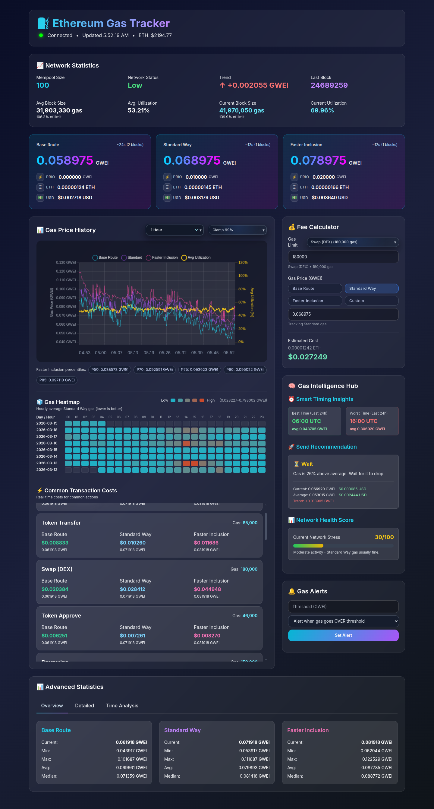

# ETH Gas Tracker (Standalone) — Overview

> This is an **overview repository** for presentation and evaluation.
> It intentionally excludes private implementation code and operational secrets.

## Positioning

ETH Gas Tracker is a **standalone, local-first realtime application** for Ethereum fee intelligence.
It runs under your control (local runtime + local UI) and is **not a hosted multi-tenant SaaS web app**.

## UI Snapshot

## Product Summary

The platform combines realtime gas telemetry, historical analysis, practical fee calculators, and operator alerts in one interface.
It is designed for speed-sensitive operators who need to decide **when** to submit a transaction and **which fee profile** to use.

## High-Level Architecture

- **Frontend Runtime (`gas_tracker.html` + `gas_tracker.js`)**
  - live cards, charts, heatmap, featured actions, alerts, and fee calculator
- **Backend API + Stream (`gas_tracker.py`)**
  - FastAPI endpoints + WebSocket broadcast for low-latency updates
- **Data Layer (SQLite)**
  - historical sample persistence, cached query responses, statistical rollups
- **Node Integration Layer**
  - Ethereum RPC/WS ingestion, block/mempool-derived metrics, fee signal normalization

## Comprehensive Feature Inventory

### A) Realtime Monitoring

1. Live connection indicator
2. Live network status visibility
3. Last update timestamp
4. Current block number display
5. Mempool size monitoring
6. Network stress card
7. Trend direction signal
8. Safe route gas tier
9. Standard route gas tier
10. Fast inclusion gas tier
11. Per-tier GWEI values
12. Per-tier ETH cost estimation
13. Per-tier USD cost estimation
14. Tier-specific priority fee display
15. Tier-specific expected confirmation window

### B) Core Analytics Panels

16. Network statistics overview panel
17. Rolling average gas metrics
18. Current vs average deltas
19. Block utilization tracking
20. Average utilization tracking
21. Block size tracking
22. Average block size tracking
23. Data range selector
24. Time-range aware charting
25. Historical gas price chart
26. Multi-series chart (safe/standard/fast)
27. Realtime chart mode for short windows
28. Historical downsample strategy for large windows
29. Historical data cache for faster redraw
30. Heatmap visualization by hour/day

### C) Action-Oriented Decision Tools

31. Fee calculator with editable gas limit
32. Preset gas-limit shortcuts by action type
33. Calculator mode switch (safe/standard/fast)
34. Manual custom gas price entry support
35. Dynamic estimated ETH output
36. Dynamic estimated USD output
37. Featured transaction costs module
38. ETH transfer cost profile
39. Token transfer cost profile
40. Token approve cost profile
41. DEX swap cost profile
42. NFT mint/sale cost profile
43. Bridge transaction cost profile
44. Lending/borrowing cost profile
45. Compound/claim-rewards cost profile

### D) Intelligence & Guidance

46. Best-time insight card
47. Worst-time insight card
48. Average cost-at-best-time metric
49. Average cost-at-worst-time metric
50. Send recommendation engine
51. Cost-optimized send recommendation
52. Speed-optimized send recommendation
53. Network stress score with advisory text
54. Hourly average trend summaries
55. Distribution metrics (median, min, max)
56. Percentile metrics (p10 / p90)
57. Route-specific historical comparisons

### E) Alerts & Operator Workflow

58. Custom gas alert creation
59. Threshold type selector (above/below)
60. Threshold value input
61. Active alerts list
62. Alert deletion control
63. Visual alert notifications
64. Session-safe UI behavior for missing widgets
65. Noise-reduced update scheduling by block changes

### F) Reliability & Systems Engineering

66. WebSocket realtime stream for low-latency updates
67. REST fallback endpoints for deterministic queries
68. Backend health endpoint
69. Database persistence for historical analytics
70. Purge endpoints for retention control (admin usage)
71. DB pragmas and indexing for performance
72. Host autodetection for local node preference
73. Feature data caching for heavy analytic views
74. Structured service logging paths for diagnostics
75. Resilient fetch/retry patterns in frontend runtime

## API Surface (High-Level)

Observed functional domains:

- Gas current snapshot
- Gas history/time-range datasets
- Gas statistics rollups
- Heatmap datasets
- Gas prediction estimates
- Featured action cost datasets
- ETH reference price
- Alerts CRUD
- Health checks
- Optional maintenance/purge operations

## Who This Overview Is For

### Recruiters

Use this repo to quickly evaluate real-world product scope:

- realtime full-stack architecture delivery
- data-heavy UI/UX implementation quality
- system reliability thinking beyond surface UI
- practical blockchain tooling focus (not toy demos)

### System Engineers / Platform Teams

Use this repo to assess architecture intent:

- websocket + REST hybrid delivery model
- local persistence + cached analytics patterns
- update scheduling to avoid wasteful polling
- observability and maintenance endpoints

### Potential Collaborators

Use this repo to understand integration and extension opportunities:

- where new route models can be added
- where new analytics modules can be attached
- where recommendation logic can be expanded

### Potential Employers

Use this repo as a concise capability map for:

- production-minded realtime dashboards
- blockchain data product execution
- decision-support interfaces under changing network conditions

## Security & Disclosure Policy

- No private source internals are published here.
- No RPC secrets, API keys, or credentials are included.
- This repository is intentionally documentation-first.

## Related App (Private Implementation)

- Private app repo: `logicencoder/eth_gas_tracker`
- This overview is the public-facing capability + architecture summary.
