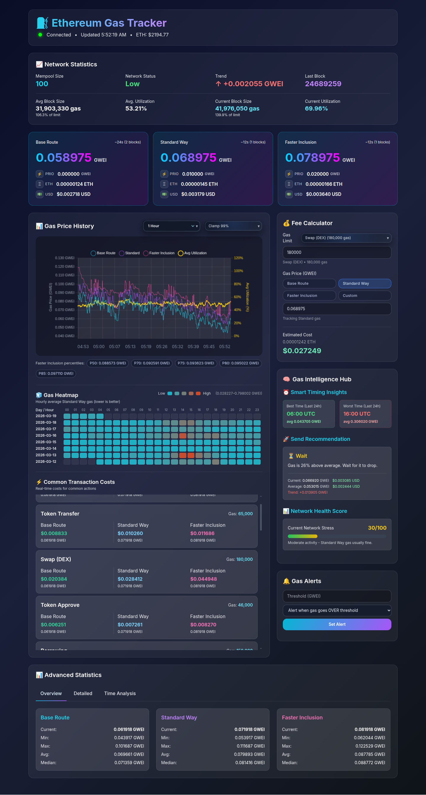

# Ethereum Gas Tracker — Product Overview (Public)

> Documentation-only repository for evaluation and portfolios.  
> No private implementation or secrets.

**Live site:** https://logicencoder.com/ethereum-gas-tracker/

---

## What is this?

**Ethereum Gas Tracker** is a realtime product for understanding **when** and **how expensively** to send Ethereum transactions. It combines live network data, historical context, and practical cost tools in one dashboard.

It exists in two delivery forms:

| Mode | Description |
|------|-------------|
| **Live website** | WordPress page + shared backend (primary public experience today) |
| **Standalone / operator** | Local-first runtime under your own machine (same UX philosophy) |

---

## What problems does it solve?

- **Fee surprise** — see tiered costs before you sign a transaction  
- **Bad timing** — heatmaps and rolling stats highlight quieter windows  
- **Guesswork** — calculator and preset actions replace vague “set gas to X”  
- **Blind spots** — mempool size, utilization, and stress indicators add context  
- **Alert fatigue vs silence** — optional thresholds when fees cross your line  

You do not need to read blocks on Etherscan manually to get a usable signal.

---

## What you can do (product features)

### Monitor

- Live network and connection status  
- Current fees for economical, standard, and faster paths  
- ETH and USD estimates per tier  
- Short **pressure / spike aware** guidance (wait vs send now)  

### Analyze

- Historical price charts  
- Hour/day **heatmap** (live site uses your local timezone)  
- Rolling ~25-hour statistics  
- Best / worst time hints  

### Plan

- Gas limit calculator with common presets  
- Featured costs for transfers, swaps, approvals, bridges, NFT actions, and more  
- Custom alerts (above/below thresholds)  

### Discover (live)

- SEO-oriented pages (fees today, calculator, network status, etc.) fed by the same live engine  

---

## Live stack (high level — no internals)

- FastAPI backend with WebSocket realtime stream  
- WordPress plugin for the public website UI  
- SQLite-backed history for charts  
- SEO rendering layer for indexable pages  
- Cloudflare Tunnel style public routing in production  

---

## Related overview repos

| Repository | Focus |
|------------|--------|
| [eth-gas-live-backend-overview-public](https://github.com/logicencoder/eth-gas-live-backend-overview-public) | Backend capabilities |
| [eth-gas-live-plugin-overview-public](https://github.com/logicencoder/eth-gas-live-plugin-overview-public) | WordPress integration |

Private implementation:

- `logicencoder/eth-gas-live-backend-private` — backend + SSR (current live code)  
- `logicencoder/eth-gas-live-plugin-private` — WordPress plugin  
- `logicencoder/eth_gas_tracker` — older standalone tree; live SSR stack is in **eth-gas-live-backend-private**

---

## Who should read this repo?

- **Recruiters / employers** — scope and product maturity at a glance  
- **Collaborators** — where the product fits before asking for repo access  
- **Users** — what the live site offers without reading source code  

---

## Disclosure

Intentionally **no private code**. Describes **what** the product does and **why**, not step-by-step implementation.
